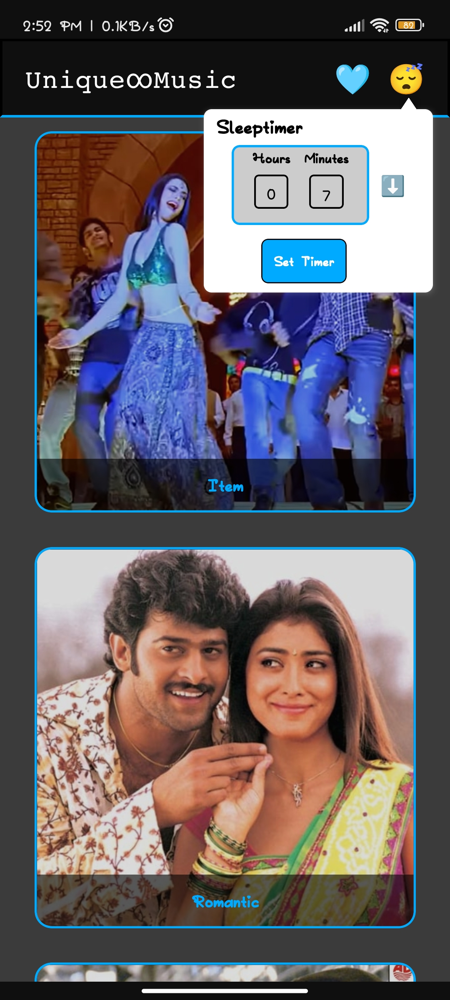

# 🎵 Unique∞Music (Android)

Unique∞Music is a React Native + Expo based music streaming app that supports background playback, autoplay, and persistent listening statistics.

---

## 🚀 Features

- 🎧 Play / Pause / Next / Previous controls
- 🔁 Auto-play next song
- 📊 Weekly listening statistics (stored locally)
- 📥 Offline persistence using AsyncStorage
- 🔊 Background audio playback
- ⚡ Fast autoplay transitions between tracks

---

## 🛠 Tech Stack

- **React Native (Expo)**
- **expo-av** for audio playback
- **AsyncStorage** for stats persistence
- **Expo EAS** for building APK files

---

## 📱 Requirements

Install dependencies before running:

```bash
npm install
```
### Here are some pictures showcasing my App UI

<table> <tr> <td></td> <td></td> <td></td> </tr> <tr> <td></td> <td></td> <td></td> </tr> </table>
